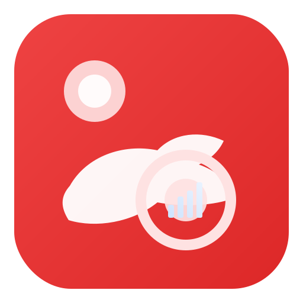

<p align="center">
  
</p>

<h1 align="center">SGCaseLens - 新加坡申请案例洞察</h1>

[SGCaseLens](https://sgcaselens.github.io/) 是一个基于真实用户案例的公开数据网站，面向新加坡 PR / Citizen 申请人，提供：

- 案例库检索与筛选
- 相似案例分析与趋势参考
- 用户匿名提交案例
- 多语言（中文/English）与明暗主题

本项目为静态网站，部署在 GitHub Pages，数据存储和查询由 Supabase 提供。

## 网站页面

- `/`：首页仪表盘（核心指标、趋势图、快速引导）
- `/pages/cases.html`：案例库（筛选、排序、详情弹窗）
- `/pages/submit.html`：提交案例（结构化表单、条款勾选）
- `/pages/insights.html`：我的分析（相似案例、对比图表）
- `/pages/trends.html`：趋势中心（行业/收入等描述性趋势）
- `/pages/my-cases.html`：我的案例（查询与管理入口）
- `/pages/edit.html?t=TOKEN`：编辑案例（基于校验信息）
- `/pages/terms.html`：条款和条件

## 技术栈

- 前端：HTML + CSS + JavaScript（无框架构建）
- 图表：ECharts
- 后端：Supabase（PostgreSQL + RPC + RLS）
- 部署：GitHub Pages

## 本地开发

项目是纯静态站点，可直接用任意静态服务打开，例如：

```bash
python3 -m http.server 4173
```

然后访问 `http://127.0.0.1:4173`。

## JS 压缩

已内置压缩命令（使用 `terser`）：

```bash
npm install
npm run minify-js
```

该命令会压缩 `js/*.js` 并原地覆盖。

## Supabase 说明

前端连接配置在 `js/config.js`（`supabaseUrl` + `anon key`）。

已采用 RLS + Policy 做最小权限控制，核心原则：

- 匿名用户仅允许必要能力（如受限提交）
- 公开读取仅允许已审核数据
- 禁止匿名更新/删除

相关 SQL 与运维脚本在 `Doc/` 目录（如安全体检、反滥用、清理测试数据等）。

## 安全与免责声明

- 本站提供的是历史样本与统计参考，不构成法律或移民结果承诺。
- 平台已加入输入校验、基础反滥用与数据库策略控制，但仍建议定期执行安全体检 SQL。

## 部署

推送到默认分支后，开启 GitHub Pages 即可发布静态站点。

## 贡献指南

欢迎提交 Issue 和 PR。为保证协作效率，请遵循以下规范。

### 分支与 PR 规范

- 从最新默认分支拉取后创建功能分支，例如：`feat/mobile-nav`、`fix/rls-policy`
- 一个 PR 聚焦一个主题（功能、修复或文档），避免混入无关改动
- PR 标题建议：
  - `feat: ...` 新功能
  - `fix: ...` 问题修复
  - `docs: ...` 文档更新
  - `refactor: ...` 重构（无行为变化）
- PR 描述至少包含：
  - 变更目的（Why）
  - 主要改动点（What）
  - 验证方式（How to test）
  - 风险与回滚说明（如涉及 Supabase SQL）

### 提交信息规范（Commit Convention）

建议使用 Conventional Commits：

```text
<type>(optional-scope): <subject>
```

常用类型：

- `feat`: 新增功能
- `fix`: 修复缺陷
- `docs`: 文档变更
- `style`: 仅样式或格式（不改逻辑）
- `refactor`: 重构（不新增功能、不修 bug）
- `test`: 测试相关
- `chore`: 构建、脚本、依赖维护

示例：

- `feat(nav): add mobile-friendly top menu`
- `fix(submit): prevent duplicate submission during pending request`
- `docs(readme): add contribution guide`

### 提交前检查清单

- 前端功能自测通过（主题切换、多语言、提交、图表）
- 执行 JS 压缩（如改动了 `js/*.js`）：
  - `npm install`
  - `npm run minify-js`
- 不提交敏感信息（密钥、账号、生产数据导出）
- 涉及 SQL 时，在 PR 中说明：
  - 影响范围（表、策略、触发器）
  - 执行顺序
  - 回滚 SQL

### 数据库与安全改动要求

- 涉及 RLS/Policy 变更时，必须附带验证结果（至少包含：
  - 匿名读是否仅限已审核数据
  - 匿名写是否被最小权限约束
  - 匿名更新/删除是否被拒绝）
- 尽量先在测试环境验证，再应用到生产环境
